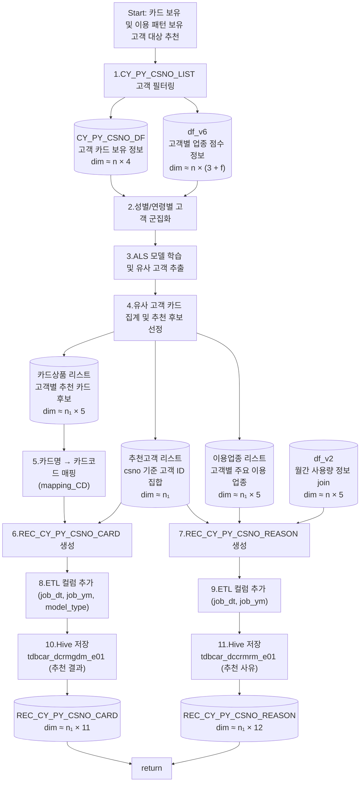

```mermaid
---

config:

    layout: dagre

---

%%{init: {'themeVariables': {'fontSize': '25px'}}}%%

flowchart TD

  

    start["Start: 카드 보유 및 이용 패턴 보유 고객 대상 추천"]

  

    start --> filter_data["1.CY_PY_CSNO_LIST 고객 필터링"]

    filter_data --> d1[("CY_PY_CSNO_DF<br/>고객 카드 보유 정보<br/>dim ≈ n × 4")]

    filter_data --> d2[("df_v6<br/>고객별 업종 점수 정보<br/>dim ≈ n × (3 + f)")]

  

    d1 --> cluster_by_demo["2.성별/연령별 고객 군집화"]

    d2 --> cluster_by_demo

  

    cluster_by_demo --> als_model["3.ALS 모델 학습 및 유사 고객 추출"]

    als_model --> rec_cards["4.유사 고객 카드 집계 및 추천 후보 선정"]

  

    rec_cards --> d3[("추천고객 리스트<br/>csno 기준 고객 ID 집합<br/>dim ≈ n₁")]

    rec_cards --> d4[("카드상품 리스트<br/>고객별 추천 카드 후보<br/>dim ≈ n₁ × 5")]

    rec_cards --> d5[("이용업종 리스트<br/>고객별 주요 이용 업종<br/>dim ≈ n₁ × 5")]

  

    d4 --> mapping_card_code["5.카드명 → 카드코드 매핑(mapping_CD)"]

  

    mapping_card_code --> rec_card_table["6.REC_CY_PY_CSNO_CARD 생성"]

    d3 --> rec_card_table

  

    d3 --> rec_reason_table["7.REC_CY_PY_CSNO_REASON 생성"]

    d5 --> rec_reason_table

    d6[("df_v2<br/>월간 사용량 정보 join<br/>dim ≈ n × 5")] --> rec_reason_table

  

    rec_card_table --> add_cols_card["8.ETL 컬럼 추가 (job_dt, job_ym, model_type)"]

    rec_reason_table --> add_cols_reason["9.ETL 컬럼 추가 (job_dt, job_ym)"]

  

    add_cols_card --> save_card["10.Hive 저장<br/>tdbcar_dcrmgdm_e01 (추천 결과)"]

    add_cols_reason --> save_reason["11.Hive 저장<br/>tdbcar_dccrmrm_e01 (추천 사유)"]

    save_card --> REC_CY_PY_CSNO_CARD[(REC_CY_PY_CSNO_CARD<br/>dim ≈ n₁ × 11)]

    save_reason --> REC_CY_PY_CSNO_REASON[(REC_CY_PY_CSNO_REASON<br/>dim ≈ n₁ × 12)]

    REC_CY_PY_CSNO_CARD --> return

    REC_CY_PY_CSNO_REASON --> return
```
