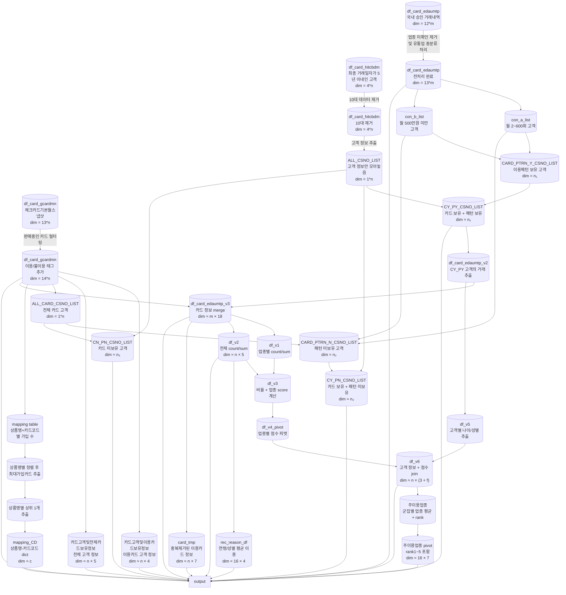

```mermaid
---

config:

  layout: dagre

---

%%{init: {'themeVariables': {'fontSize': '25px'}}}%%

flowchart TD

    %% 고객 정보 전처리

    h[("df_card_hitcbdm<br>최종 거래일자가 5년 이내인 고객<br>dim = 4*n")]

    h -->|10대 데이터 제거| hit[("df_card_hitcbdm<br>10대 제거<br>dim = 4*n")]

    hit -->|고객 정보 추출| ALL_CSNO_LIST[("ALL_CSNO_LIST<br>고객 정보만 모아놓음<br>dim = 1*n")]

  

    %% 카드 정보 처리

    c[("df_card_gcardmn<br>체크카드기본월스냅샷<br>dim = 13*n")]

    c -->|판매중인 카드 필터링| card[("df_card_gcardmn<br>이용/불이용 태그 추가<br>dim = 14*n")]

    card --> card_using_customer[("카드고객및이용카드보유정보<br>이용카드 고객 정보<br>dim ≈ n × 4")]

    card --> card_all_customer[("카드고객및전체카드보유정보<br>전체 고객 정보<br>dim ≈ n × 5")]

    card --> ALL_CARD_CSNO_LIST[("ALL_CARD_CSNO_LIST<br>전체 카드 고객<br>dim = 1*n")]

    card --> mt[("mapping table<br>상품명+카드코드별 가입 수")]

    mt --> mt2[("상품명별 정렬 후 최대가입카드 추출")]

    mt2 --> mt3[("상품명별 상위 1개 추출")]

    mt3 --> mtcd[("mapping_CD<br>상품명-카드코드 dict<br>dim ≈ c")]

  

    %% 거래 데이터 전처리

    e[("df_card_edaumtp<br>국내 승인 거래내역<br>dim = 12*m")]

    e -->|업종 미확인 제거 및 유통업 중분류 처리| edau[("df_card_edaumtp<br>전처리 완료<br>dim = 13*m")]

  

    %% 패턴 기반 조건

    edau --> con_a[("con_a_list<br>월 2~600회 고객")]

    edau --> con_b[("con_b_list<br>월 500만원 미만 고객")]

    con_a --> CARD_PTRN_Y_CSNO_LIST[("CARD_PTRN_Y_CSNO_LIST<br>이용패턴 보유 고객<br>dim ≈ n₁")]

    con_b --> CARD_PTRN_Y_CSNO_LIST

    ALL_CARD_CSNO_LIST --> CARD_PTRN_N_CSNO_LIST[("CARD_PTRN_N_CSNO_LIST<br>패턴 미보유 고객<br>dim ≈ n₂")]

    con_a --> CARD_PTRN_N_CSNO_LIST

    con_b --> CARD_PTRN_N_CSNO_LIST

  

    ALL_CSNO_LIST --> CY_PY_CSNO_LIST[("CY_PY_CSNO_LIST<br>카드 보유 + 패턴 보유<br>dim ≈ n₁")]

    CARD_PTRN_Y_CSNO_LIST --> CY_PY_CSNO_LIST

  

    ALL_CSNO_LIST --> CY_PN_CSNO_LIST[("CY_PN_CSNO_LIST<br>카드 보유 + 패턴 미보유<br>dim ≈ n₂")]

    CARD_PTRN_N_CSNO_LIST --> CY_PN_CSNO_LIST

  

    ALL_CSNO_LIST --> CN_PN_CSNO_LIST[("CN_PN_CSNO_LIST<br>카드 미보유 고객<br>dim ≈ n₃")]

    ALL_CARD_CSNO_LIST --> CN_PN_CSNO_LIST

  

    %% 패턴 고객 분석 시작

    CY_PY_CSNO_LIST --> df_card_edaumtp_v2[("df_card_edaumtp_v2<br>CY_PY 고객의 거래 추출")]

    df_card_edaumtp_v2 --> df_card_edaumtp_v3[("df_card_edaumtp_v3<br>카드 정보 merge<br>dim ≈ m × 18")]

    card --> df_card_edaumtp_v3

    df_card_edaumtp_v2 --> df_v5[("df_v5<br>고객별 나이/성별 추출")]

  

    %% 업종별 사용량

    df_card_edaumtp_v3 --> df_v1[("df_v1<br>업종별 count/sum")]

    df_card_edaumtp_v3 --> df_v2[("df_v2<br>전체 count/sum<br>dim ≈ n × 5")]

    df_card_edaumtp_v3 --> card_tmp[("card_tmp<br>중복제거된 이용카드 정보<br>dim ≈ n × 7")]


  

    df_v1 --> df_v3[("df_v3<br>비율 + 업종 score 계산")]

    df_v2 --> df_v3

    df_v3 --> df_v4_pivot[("df_v4_pivot<br>업종별 점수 피벗")]

    df_v4_pivot --> df_v6[("df_v6<br>고객 정보 + 점수 join<br>dim ≈ n × (3 + f)")]

  

    df_v5 --> df_v6

    df_v2 --> rec_reason_df[("rec_reason_df<br>연령/성별 평균 이용<br>dim ≈ 16 × 4")]

  

    %% 주이용 업종 추출

    df_v6 --> 주이용업종[("주이용업종<br>군집별 업종 평균 + rank")]

    주이용업종 --> 주이용업종_pivot[("주이용업종 pivot<br>rank1~5 포함<br>dim ≈ 16 × 7")]

  

    %% Output


    df_v6 --> out["output"]

    card_tmp --> out

    rec_reason_df --> out

    주이용업종_pivot --> out

    card_using_customer --> out

    card_all_customer --> out

    mtcd --> out

    df_card_edaumtp_v3 --> out

    CY_PY_CSNO_LIST --> out

    CY_PN_CSNO_LIST --> out

    CN_PN_CSNO_LIST --> out

    df_v2 --> out

    edau --> out

    card --> out
```