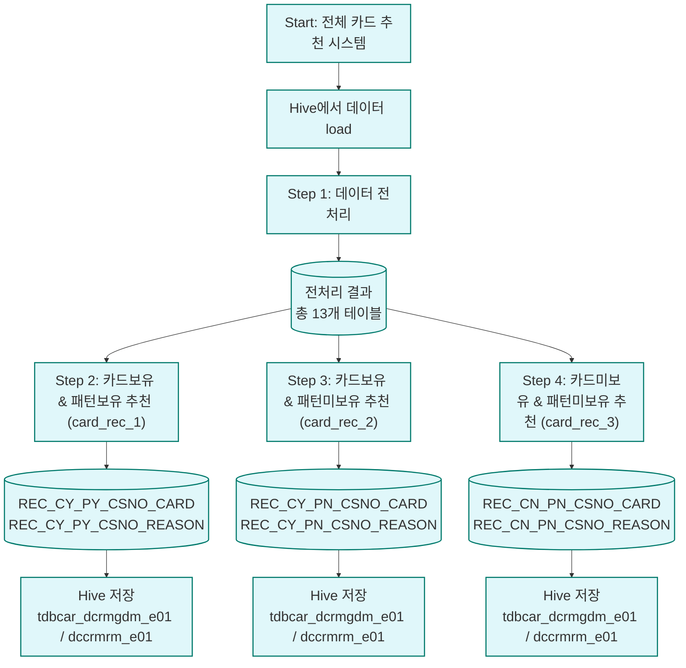

```mermaid
---
config:
  layout: dagre
---
%%{init: {'themeVariables': {'fontSize': '25px'}}}%%

flowchart TD

  start_all["Start: 전체 카드 추천 시스템"]

  start_all --> step0["Hive에서 데이터 load"]
  
  step0 --> step1["Step 1: 데이터 전처리"]
  step1 --> out_pre[("전처리 결과<br/>총 13개 테이블")] 

  out_pre --> rec1["Step 2: 카드보유 & 패턴보유 추천 (card_rec_1)"]
  rec1 --> out1[("REC_CY_PY_CSNO_CARD<br/>REC_CY_PY_CSNO_REASON")] 

  out_pre --> rec2["Step 3: 카드보유 & 패턴미보유 추천 (card_rec_2)"]
  rec2 --> out2[("REC_CY_PN_CSNO_CARD<br/>REC_CY_PN_CSNO_REASON")] 

  out_pre --> rec3["Step 4: 카드미보유 & 패턴미보유 추천 (card_rec_3)"]
  rec3 --> out3[("REC_CN_PN_CSNO_CARD<br/>REC_CN_PN_CSNO_REASON")] 

  out1 --> hive1["Hive 저장<br/>tdbcar_dcrmgdm_e01 / dccrmrm_e01"]
  out2 --> hive2["Hive 저장<br/>tdbcar_dcrmgdm_e01 / dccrmrm_e01"]
  out3 --> hive3["Hive 저장<br/>tdbcar_dcrmgdm_e01 / dccrmrm_e01"]

  classDef phase fill:#e0f7fa,stroke:#00796b,stroke-width:2px;
  class step0,step1,rec1,rec2,rec3,start_all phase;
  class out1,out2,out3,hive1,hive2,hive3,out_pre phase;
```