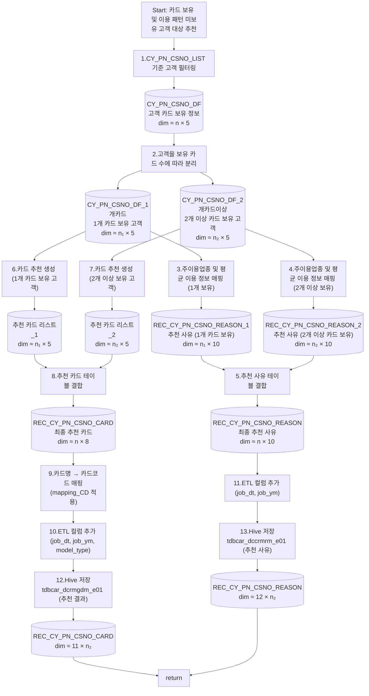

```mermaid
---
config:
  layout: dagre
---

%%{init: {'themeVariables': {'fontSize': '25px'}}}%%

flowchart TD

  start2["Start: 카드 보유 및 이용 패턴 미보유 고객 대상 추천"]

  start2 --> filter2["1.CY_PN_CSNO_LIST 기준 고객 필터링"]
  filter2 --> d1_2[("CY_PN_CSNO_DF<br/>고객 카드 보유 정보<br/>dim ≈ n × 5")]
  d1_2 --> split_card_count["2.고객을 보유 카드 수에 따라 분리"]
  split_card_count --> d2_1[("CY_PN_CSNO_DF_1개카드<br/>1개 카드 보유 고객<br/>dim ≈ n₁ × 5")]
  split_card_count --> d2_2[("CY_PN_CSNO_DF_2개카드이상<br/>2개 이상 카드 보유 고객<br/>dim ≈ n₂ × 5")]

  d2_1 --> reason1["3.주이용업종 및 평균 이용 정보 매핑 (1개 보유)"]
  d2_2 --> reason2["4.주이용업종 및 평균 이용 정보 매핑 (2개 이상 보유)"]

  reason1 --> d3_1[("REC_CY_PN_CSNO_REASON_1<br/>추천 사유 (1개 카드 보유)<br/>dim ≈ n₁ × 10")]
  reason2 --> d3_2[("REC_CY_PN_CSNO_REASON_2<br/>추천 사유 (2개 이상 카드 보유)<br/>dim ≈ n₂ × 10")]

  d3_1 --> concat_reason["5.추천 사유 테이블 결합"]
  d3_2 --> concat_reason
  concat_reason --> rec_reason_final[("REC_CY_PN_CSNO_REASON<br/>최종 추천 사유<br/>dim ≈ n × 10")]

  d2_1 --> recommend_1["6.카드 추천 생성 (1개 카드 보유 고객)"]
  d2_2 --> recommend_2["7.카드 추천 생성 (2개 이상 보유 고객)"]

  recommend_1 --> d4_1[("추천 카드 리스트_1<br/>dim ≈ n₁ × 5")]
  recommend_2 --> d4_2[("추천 카드 리스트_2<br/>dim ≈ n₂ × 5")]

  d4_1 --> concat_card["8.추천 카드 테이블 결합"]
  d4_2 --> concat_card
  concat_card --> rec_card_final[("REC_CY_PN_CSNO_CARD<br/>최종 추천 카드<br/>dim ≈ n × 8")]

  rec_card_final --> map_card_cd["9.카드명 → 카드코드 매핑(mapping_CD 적용)"]
  map_card_cd --> add_cols_card2["10.ETL 컬럼 추가 (job_dt, job_ym, model_type)"]
  rec_reason_final --> add_cols_reason2["11.ETL 컬럼 추가 (job_dt, job_ym)"]

  add_cols_card2 --> save_card2["12.Hive 저장<br/>tdbcar_dcrmgdm_e01 (추천 결과)"]
  add_cols_reason2 --> save_reason2["13.Hive 저장<br/>tdbcar_dccrmrm_e01 (추천 사유)"]
  

  save_card2 --> REC_CY_PN_CSNO_CARD[(REC_CY_PN_CSNO_CARD<br/>dim ≈ 11 × n₂)]
  save_reason2 --> REC_CY_PN_CSNO_REASON[(REC_CY_PN_CSNO_REASON<br/>dim ≈ 12 × n₂)]

  REC_CY_PN_CSNO_CARD --> out2["return"]
  REC_CY_PN_CSNO_REASON --> out2["return"]

```