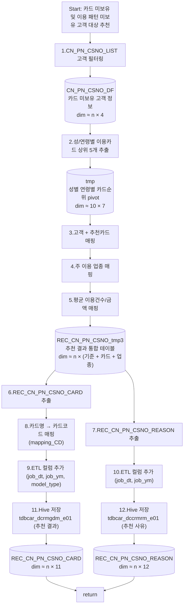

```mermaid
---
config:
    layout: dagre
---
%%{init: {'themeVariables': {'fontSize': '25px'}}}%%
flowchart TD

    start3["Start: 카드 미보유 및 이용 패턴 미보유 고객 대상 추천"]

    start3 --> filter3["1.CN_PN_CSNO_LIST 고객 필터링"]
    filter3 --> d1_3[("CN_PN_CSNO_DF<br/>카드 미보유 고객 정보<br/>dim ≈ n × 4")]

    d1_3 --> group_top5_cards["2.성/연령별 이용카드 상위 5개 추출"]
    group_top5_cards --> d2_3[("tmp<br/>성별 연령별 카드순위 pivot<br/>dim ≈ 10 × 7")]

    d2_3 --> merge1["3.고객 + 추천카드 매핑"]
    merge1 --> merge2["4.주 이용 업종 매핑"]
    merge2 --> merge3["5.평균 이용건수/금액 매핑"]
    merge3 --> d3_3[("REC_CN_PN_CSNO_tmp3<br/>추천 결과 통합 테이블<br/>dim ≈ n × (기준 + 카드 + 업종)")]

    d3_3 --> rec_card3["6.REC_CN_PN_CSNO_CARD 추출"]
    d3_3 --> rec_reason3["7.REC_CN_PN_CSNO_REASON 추출"]

    rec_card3 --> map_card_cd3["8.카드명 → 카드코드 매핑(mapping_CD)"]
    map_card_cd3 --> add_cols_card3["9.ETL 컬럼 추가 (job_dt, job_ym, model_type)"]
    rec_reason3 --> add_cols_reason3["10.ETL 컬럼 추가 (job_dt, job_ym)"]

    add_cols_card3 --> save_card3["11.Hive 저장<br/>tdbcar_dcrmgdm_e01 (추천 결과)"]
    add_cols_reason3 --> save_reason3["12.Hive 저장<br/>tdbcar_dccrmrm_e01 (추천 사유)"]

    save_card3 --> REC_CN_PN_CSNO_CARD[(REC_CN_PN_CSNO_CARD<br/>dim ≈ n × 11)]

    save_reason3 --> REC_CN_PN_CSNO_REASON[(REC_CN_PN_CSNO_REASON<br/>dim ≈ n × 12)]

    REC_CN_PN_CSNO_CARD --> return

    REC_CN_PN_CSNO_REASON --> return

```
