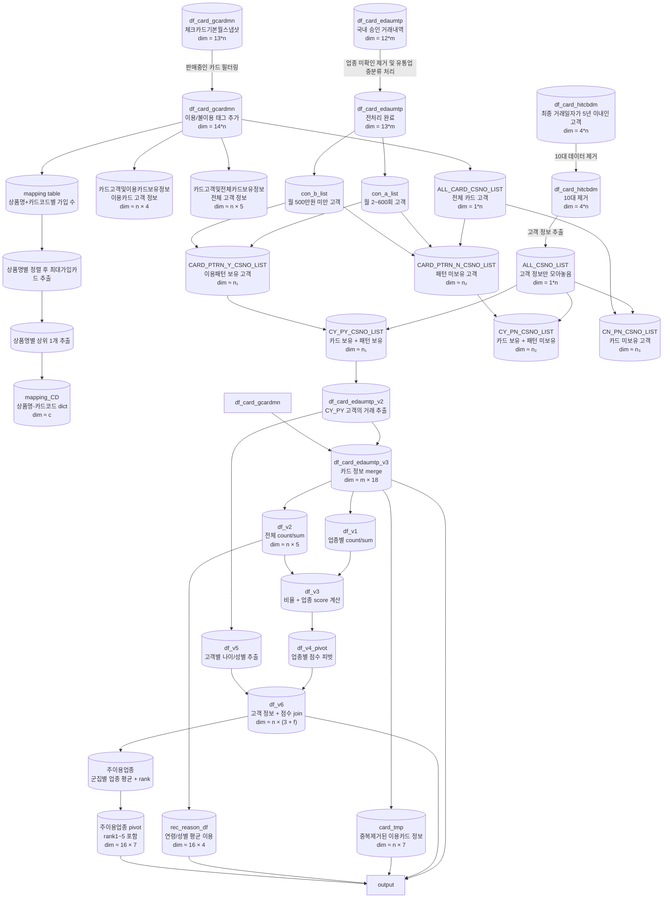
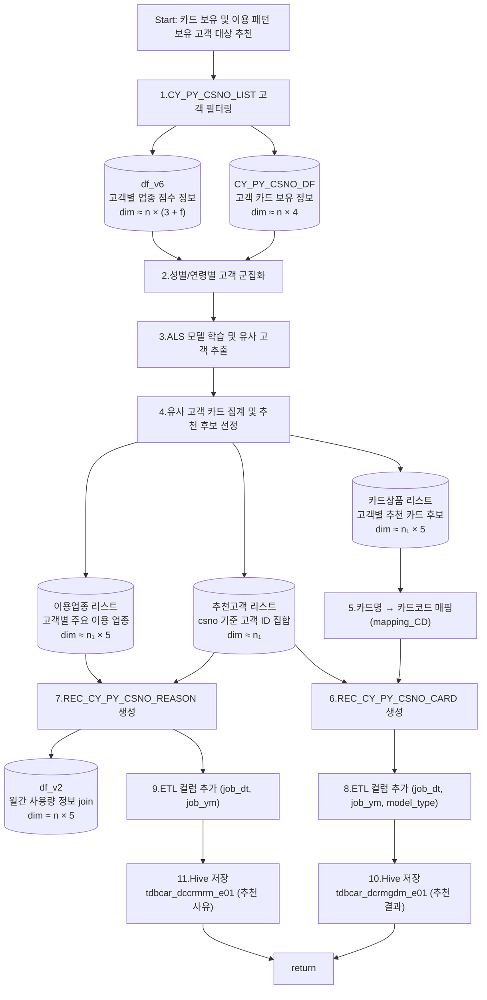
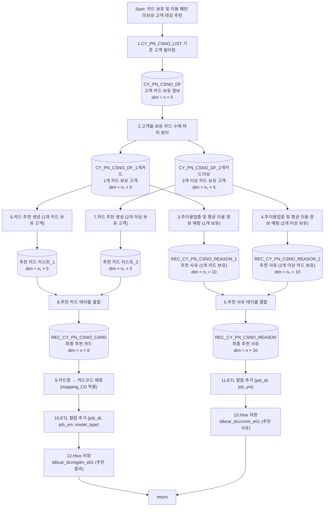
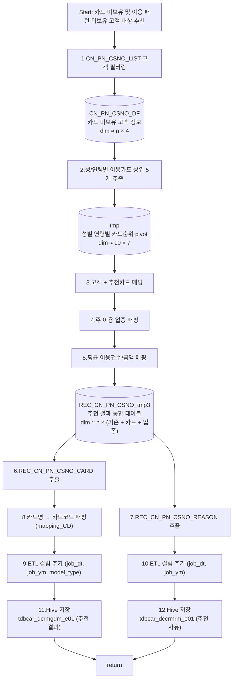
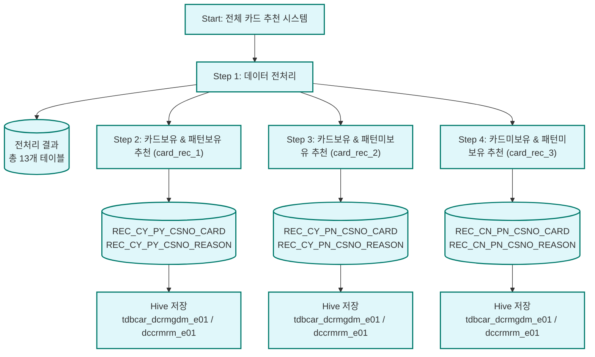

```mermaid
---

config:

  layout: dagre

---

flowchart TD

    %% 고객 정보 전처리

    h[("df_card_hitcbdm<br>최종 거래일자가 5년 이내인 고객<br>dim = 4*n")]

    h -->|10대 데이터 제거| hit[("df_card_hitcbdm<br>10대 제거<br>dim = 4*n")]

    hit -->|고객 정보 추출| ALL_CSNO_LIST[("ALL_CSNO_LIST<br>고객 정보만 모아놓음<br>dim = 1*n")]

  

    %% 카드 정보 처리

    c[("df_card_gcardmn<br>체크카드기본월스냅샷<br>dim = 13*n")]

    c -->|판매중인 카드 필터링| card[("df_card_gcardmn<br>이용/불이용 태그 추가<br>dim = 14*n")]

    card --> card_using_customer[("카드고객및이용카드보유정보<br>이용카드 고객 정보<br>dim ≈ n × 4")]

    card --> card_all_customer[("카드고객및전체카드보유정보<br>전체 고객 정보<br>dim ≈ n × 5")]

    card --> ALL_CARD_CSNO_LIST[("ALL_CARD_CSNO_LIST<br>전체 카드 고객<br>dim = 1*n")]

    card --> mt[("mapping table<br>상품명+카드코드별 가입 수")]

    mt --> mt2[("상품명별 정렬 후 최대가입카드 추출")]

    mt2 --> mt3[("상품명별 상위 1개 추출")]

    mt3 --> mtcd[("mapping_CD<br>상품명-카드코드 dict<br>dim ≈ c")]

  

    %% 거래 데이터 전처리

    e[("df_card_edaumtp<br>국내 승인 거래내역<br>dim = 12*m")]

    e -->|업종 미확인 제거 및 유통업 중분류 처리| edau[("df_card_edaumtp<br>전처리 완료<br>dim = 13*m")]

  

    %% 패턴 기반 조건

    edau --> con_a[("con_a_list<br>월 2~600회 고객")]

    edau --> con_b[("con_b_list<br>월 500만원 미만 고객")]

    con_a --> CARD_PTRN_Y_CSNO_LIST[("CARD_PTRN_Y_CSNO_LIST<br>이용패턴 보유 고객<br>dim ≈ n₁")]

    con_b --> CARD_PTRN_Y_CSNO_LIST

    ALL_CARD_CSNO_LIST --> CARD_PTRN_N_CSNO_LIST[("CARD_PTRN_N_CSNO_LIST<br>패턴 미보유 고객<br>dim ≈ n₂")]

    con_a --> CARD_PTRN_N_CSNO_LIST

    con_b --> CARD_PTRN_N_CSNO_LIST

  

    ALL_CSNO_LIST --> CY_PY_CSNO_LIST[("CY_PY_CSNO_LIST<br>카드 보유 + 패턴 보유<br>dim ≈ n₁")]

    CARD_PTRN_Y_CSNO_LIST --> CY_PY_CSNO_LIST

  

    ALL_CSNO_LIST --> CY_PN_CSNO_LIST[("CY_PN_CSNO_LIST<br>카드 보유 + 패턴 미보유<br>dim ≈ n₂")]

    CARD_PTRN_N_CSNO_LIST --> CY_PN_CSNO_LIST

  

    ALL_CSNO_LIST --> CN_PN_CSNO_LIST[("CN_PN_CSNO_LIST<br>카드 미보유 고객<br>dim ≈ n₃")]

    ALL_CARD_CSNO_LIST --> CN_PN_CSNO_LIST

  

    %% 패턴 고객 분석 시작

    CY_PY_CSNO_LIST --> df_card_edaumtp_v2[("df_card_edaumtp_v2<br>CY_PY 고객의 거래 추출")]

    df_card_edaumtp_v2 --> df_card_edaumtp_v3[("df_card_edaumtp_v3<br>카드 정보 merge<br>dim ≈ m × 18")]

    df_card_gcardmn --> df_card_edaumtp_v3

    df_card_edaumtp_v2 --> df_v5[("df_v5<br>고객별 나이/성별 추출")]

  

    %% 업종별 사용량

    df_card_edaumtp_v3 --> df_v1[("df_v1<br>업종별 count/sum")]

    df_card_edaumtp_v3 --> df_v2[("df_v2<br>전체 count/sum<br>dim ≈ n × 5")]

    df_card_edaumtp_v3 --> card_tmp[("card_tmp<br>중복제거된 이용카드 정보<br>dim ≈ n × 7")]

    df_card_edaumtp_v3 --> out

  

    df_v1 --> df_v3[("df_v3<br>비율 + 업종 score 계산")]

    df_v2 --> df_v3

    df_v3 --> df_v4_pivot[("df_v4_pivot<br>업종별 점수 피벗")]

    df_v4_pivot --> df_v6[("df_v6<br>고객 정보 + 점수 join<br>dim ≈ n × (3 + f)")]

  

    df_v5 --> df_v6

    df_v2 --> rec_reason_df[("rec_reason_df<br>연령/성별 평균 이용<br>dim ≈ 16 × 4")]

  

    %% 주이용 업종 추출

    df_v6 --> 주이용업종[("주이용업종<br>군집별 업종 평균 + rank")]

    주이용업종 --> 주이용업종_pivot[("주이용업종 pivot<br>rank1~5 포함<br>dim ≈ 16 × 7")]

  

    %% Output

    df_v6 --> out["output"]

    card_tmp --> out

    rec_reason_df --> out

    주이용업종_pivot --> out
```

card_rec_1()

```mermaid
---

config:

  layout: dagre

---

flowchart TD

  

  start["Start: 카드 보유 및 이용 패턴 보유 고객 대상 추천"]

  

  start --> filter_data["1.CY_PY_CSNO_LIST 고객 필터링"]

  filter_data --> d1[("CY_PY_CSNO_DF<br/>고객 카드 보유 정보<br/>dim ≈ n × 4")]

  filter_data --> d2[("df_v6<br/>고객별 업종 점수 정보<br/>dim ≈ n × (3 + f)")]

  

  d1 --> cluster_by_demo["2.성별/연령별 고객 군집화"]

  d2 --> cluster_by_demo

  

  cluster_by_demo --> als_model["3.ALS 모델 학습 및 유사 고객 추출"]

  als_model --> rec_cards["4.유사 고객 카드 집계 및 추천 후보 선정"]

  

  rec_cards --> d3[("추천고객 리스트<br/>csno 기준 고객 ID 집합<br/>dim ≈ n₁")]

  rec_cards --> d4[("카드상품 리스트<br/>고객별 추천 카드 후보<br/>dim ≈ n₁ × 5")]

  rec_cards --> d5[("이용업종 리스트<br/>고객별 주요 이용 업종<br/>dim ≈ n₁ × 5")]

  

  d4 --> mapping_card_code["5.카드명 → 카드코드 매핑(mapping_CD)"]

  

  mapping_card_code --> rec_card_table["6.REC_CY_PY_CSNO_CARD 생성"]

  d3 --> rec_card_table

  

  d3 --> rec_reason_table["7.REC_CY_PY_CSNO_REASON 생성"]

  d5 --> rec_reason_table

  rec_reason_table --> d6[("df_v2<br/>월간 사용량 정보 join<br/>dim ≈ n × 5")]

  

  rec_card_table --> add_cols_card["8.ETL 컬럼 추가 (job_dt, job_ym, model_type)"]

  rec_reason_table --> add_cols_reason["9.ETL 컬럼 추가 (job_dt, job_ym)"]

  

  add_cols_card --> save_card["10.Hive 저장<br/>tdbcar_dcrmgdm_e01 (추천 결과)"]

  add_cols_reason --> save_reason["11.Hive 저장<br/>tdbcar_dccrmrm_e01 (추천 사유)"]

  

  save_card --> return

  save_reason --> return
```

card_rec2()

```mermaid
---
config:
  layout: dagre
---
flowchart TD

  start2["Start: 카드 보유 및 이용 패턴 미보유 고객 대상 추천"]

  start2 --> filter2["1.CY_PN_CSNO_LIST 기준 고객 필터링"]
  filter2 --> d1_2[("CY_PN_CSNO_DF<br/>고객 카드 보유 정보<br/>dim ≈ n × 5")]
  d1_2 --> split_card_count["2.고객을 보유 카드 수에 따라 분리"]
  split_card_count --> d2_1[("CY_PN_CSNO_DF_1개카드<br/>1개 카드 보유 고객<br/>dim ≈ n₁ × 5")]
  split_card_count --> d2_2[("CY_PN_CSNO_DF_2개카드이상<br/>2개 이상 카드 보유 고객<br/>dim ≈ n₂ × 5")]

  d2_1 --> reason1["3.주이용업종 및 평균 이용 정보 매핑 (1개 보유)"]
  d2_2 --> reason2["4.주이용업종 및 평균 이용 정보 매핑 (2개 이상 보유)"]

  reason1 --> d3_1[("REC_CY_PN_CSNO_REASON_1<br/>추천 사유 (1개 카드 보유)<br/>dim ≈ n₁ × 10")]
  reason2 --> d3_2[("REC_CY_PN_CSNO_REASON_2<br/>추천 사유 (2개 이상 카드 보유)<br/>dim ≈ n₂ × 10")]

  d3_1 --> concat_reason["5.추천 사유 테이블 결합"]
  d3_2 --> concat_reason
  concat_reason --> rec_reason_final[("REC_CY_PN_CSNO_REASON<br/>최종 추천 사유<br/>dim ≈ n × 10")]

  d2_1 --> recommend_1["6.카드 추천 생성 (1개 카드 보유 고객)"]
  d2_2 --> recommend_2["7.카드 추천 생성 (2개 이상 보유 고객)"]

  recommend_1 --> d4_1[("추천 카드 리스트_1<br/>dim ≈ n₁ × 5")]
  recommend_2 --> d4_2[("추천 카드 리스트_2<br/>dim ≈ n₂ × 5")]

  d4_1 --> concat_card["8.추천 카드 테이블 결합"]
  d4_2 --> concat_card
  concat_card --> rec_card_final[("REC_CY_PN_CSNO_CARD<br/>최종 추천 카드<br/>dim ≈ n × 8")]

  rec_card_final --> map_card_cd["9.카드명 → 카드코드 매핑(mapping_CD 적용)"]
  map_card_cd --> add_cols_card2["10.ETL 컬럼 추가 (job_dt, job_ym, model_type)"]
  rec_reason_final --> add_cols_reason2["11.ETL 컬럼 추가 (job_dt, job_ym)"]

  add_cols_card2 --> save_card2["12.Hive 저장<br/>tdbcar_dcrmgdm_e01 (추천 결과)"]
  add_cols_reason2 --> save_reason2["13.Hive 저장<br/>tdbcar_dccrmrm_e01 (추천 사유)"]

  save_card2 --> out2["return"]
  save_reason2 --> out2["return"]

```

card_rec_3()

```mermaid
---
config:
  layout: dagre
---
flowchart TD

  start3["Start: 카드 미보유 및 이용 패턴 미보유 고객 대상 추천"]

  start3 --> filter3["1.CN_PN_CSNO_LIST 고객 필터링"]
  filter3 --> d1_3[("CN_PN_CSNO_DF<br/>카드 미보유 고객 정보<br/>dim ≈ n × 4")]

  d1_3 --> group_top5_cards["2.성/연령별 이용카드 상위 5개 추출"]
  group_top5_cards --> d2_3[("tmp<br/>성별 연령별 카드순위 pivot<br/>dim ≈ 10 × 7")]

  d2_3 --> merge1["3.고객 + 추천카드 매핑"]
  merge1 --> merge2["4.주 이용 업종 매핑"]
  merge2 --> merge3["5.평균 이용건수/금액 매핑"]
  merge3 --> d3_3[("REC_CN_PN_CSNO_tmp3<br/>추천 결과 통합 테이블<br/>dim ≈ n × (기준 + 카드 + 업종)")]

  d3_3 --> rec_card3["6.REC_CN_PN_CSNO_CARD 추출"]
  d3_3 --> rec_reason3["7.REC_CN_PN_CSNO_REASON 추출"]

  rec_card3 --> map_card_cd3["8.카드명 → 카드코드 매핑(mapping_CD)"]
  map_card_cd3 --> add_cols_card3["9.ETL 컬럼 추가 (job_dt, job_ym, model_type)"]
  rec_reason3 --> add_cols_reason3["10.ETL 컬럼 추가 (job_dt, job_ym)"]

  add_cols_card3 --> save_card3["11.Hive 저장<br/>tdbcar_dcrmgdm_e01 (추천 결과)"]
  add_cols_reason3 --> save_reason3["12.Hive 저장<br/>tdbcar_dccrmrm_e01 (추천 사유)"]

  save_card3 --> out3["return"]
  save_reason3 --> out3["return"]

```

```mermaid
---
config:
  layout: dagre
---
flowchart TD

  start_all["Start: 전체 카드 추천 시스템"]

  start_all --> step1["Step 1: 데이터 전처리"]
  step1 --> out_pre[("전처리 결과<br/>총 13개 테이블")] 

  step1 --> rec1["Step 2: 카드보유 & 패턴보유 추천 (card_rec_1)"]
  rec1 --> out1[("REC_CY_PY_CSNO_CARD<br/>REC_CY_PY_CSNO_REASON")] 

  step1 --> rec2["Step 3: 카드보유 & 패턴미보유 추천 (card_rec_2)"]
  rec2 --> out2[("REC_CY_PN_CSNO_CARD<br/>REC_CY_PN_CSNO_REASON")] 

  step1 --> rec3["Step 4: 카드미보유 & 패턴미보유 추천 (card_rec_3)"]
  rec3 --> out3[("REC_CN_PN_CSNO_CARD<br/>REC_CN_PN_CSNO_REASON")] 

  out1 --> hive1["Hive 저장<br/>tdbcar_dcrmgdm_e01 / dccrmrm_e01"]
  out2 --> hive2["Hive 저장<br/>tdbcar_dcrmgdm_e01 / dccrmrm_e01"]
  out3 --> hive3["Hive 저장<br/>tdbcar_dcrmgdm_e01 / dccrmrm_e01"]

  classDef phase fill:#e0f7fa,stroke:#00796b,stroke-width:2px;
  class step1,rec1,rec2,rec3,start_all phase;
  class out1,out2,out3,hive1,hive2,hive3,out_pre phase;
```

